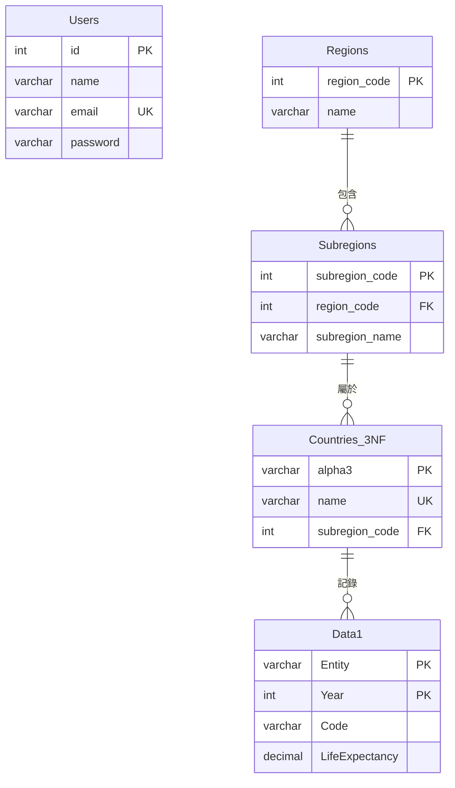

```mermaid
erDiagram
    %% 實體定義
    Users {
        int id PK
        varchar name
        varchar email UK
        varchar password
    }

    Regions {
        int region_code PK
        varchar name
    }

    Subregions {
        int subregion_code PK
        int region_code FK
        varchar subregion_name
    }

    Countries_3NF {
        varchar alpha3 PK
        varchar name UK
        int subregion_code FK
    }

    Data1 {
        varchar Entity PK
        int Year PK
        varchar Code
        decimal LifeExpectancy
    }

    %% 關係定義 (一對多)

    Regions ||--o{ Subregions : "包含"
    Subregions ||--o{ Countries_3NF : "屬於"
    
    %% Data1 與 Countries_3NF 之間是隱含的一對多關係
    Countries_3NF ||--o{ Data1 : "記錄"
```
